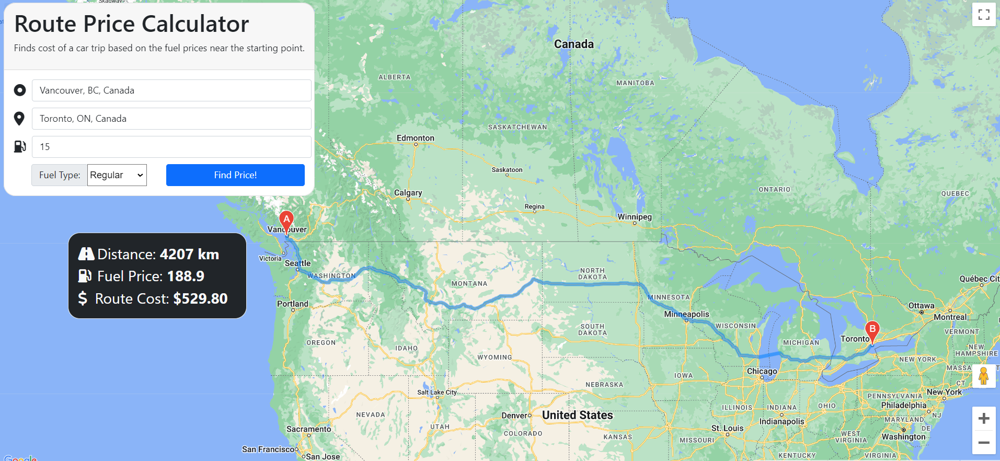

# [Route Price Calculator](routeprice.ca)

## Description
This is a website calculates the price of a car trip using current gas prices in the vicinity of the starting location. Route is displayed using Google Maps API. Locations are restricted to Canada.  

## Resources Used 

Google Maps Distance API: https://www.youtube.com/watch?v=BkGtNBrOhKU&t=1062s&ab_channel=SamCodes  
Google Maps API Documentation: https://developers.google.com/maps/documentation  
Fuel Prices taken from: https://www.gasbuddy.com  
Project Inspired by: https://devpost.com/software/road-code  
